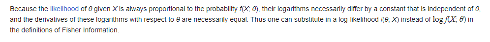
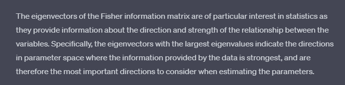

The negative likelihood function of the gaussian PDF has the form
$$
\chi^2(\boldsymbol{\mu})=-2 \log(L)= (\boldsymbol{\mu}-\hat{\boldsymbol{\mu}})^TV_{STXS}^{-1} (\boldsymbol{\mu}-\hat{\boldsymbol{\mu}})
$$
with $\hat{\boldsymbol{\mu}}$ is the experimental measurement, the hessian matrix of $\chi^2$ assuming $V^{-1}_{STXS}$ is $\mu$ independent:
$$
\begin{align*}
	H(\chi^2)&=\frac{\partial^2 \chi^2}{\partial \boldsymbol{\mu} \partial \boldsymbol{\mu}^T }\\
&=\frac{\partial^2 }{\partial \boldsymbol{\mu} \partial \boldsymbol{\mu}^T }\left[(\boldsymbol{\mu}-\hat{\boldsymbol{\mu}})^TV_{STXS}^{-1} (\boldsymbol{\mu}-\hat{\boldsymbol{\mu}})\right]\\
&=\frac{\partial^2 }{\partial \boldsymbol{\mu} \partial \boldsymbol{\mu}^T }\left[\boldsymbol{\mu}^TV_{STXS}^{-1} \boldsymbol{\mu}\right]\\
&=2V^{-1}
\end{align*}
$$
$$
V_{STXS}^{-1}=\begin{pmatrix}
 \frac{\partial^2 \chi^2}{\partial \mu_1^2} &\frac{\partial^2 \chi^2}{\partial \mu_1 \partial\mu_2} & \dots &\frac{\partial^2 \chi^2}{\partial \mu_1 \partial\mu_n}\\
 \frac{\partial^2 \chi^2}{\partial \mu_2 \partial\mu_1} &\frac{\partial^2 \chi^2}{\partial \mu_2 \partial\mu_2} & \dots &\frac{\partial^2 \chi^2}{\partial \mu_2 \partial\mu_n}\\
 \dots  &\dots &\dots &\dots \\
 \frac{\partial^2 \chi^2}{\partial \mu_n \partial\mu_1} &\frac{\partial^2 \chi^2}{\partial \mu_n \partial\mu_2} & \dots &\frac{\partial^2 \chi^2}{\partial \mu_n \partial\mu_n}\\

\end{pmatrix}
$$
So we have our $V_{STXS}^{-1}$ is hessian matrix of the negative likelihood function
$$
\begin{align*}
	\Rightarrow\frac{\partial^2 \chi^2}{\partial \boldsymbol{c} \partial \boldsymbol{c}^T }&=\frac{\partial \boldsymbol{\mu}}{\partial \boldsymbol{c}} \frac{\partial}{\partial \boldsymbol{\mu}} \left[\frac{\partial \boldsymbol{\mu}}{\partial \boldsymbol{c}} \frac{\partial}{\partial \boldsymbol{\mu}}\right]^T \chi^2\\
&=\frac{\partial \boldsymbol{\mu}}{\partial \boldsymbol{c}} \frac{\partial}{\partial \boldsymbol{\mu}}\frac{\partial \chi^{2}}{\partial \boldsymbol{\mu^T}} \left[\frac{\partial \boldsymbol{\mu}}{\partial \boldsymbol{c}} \right]^T \\
&=\frac{\partial \boldsymbol{\mu}}{\partial \boldsymbol{c}} \frac{\partial \chi^{2}}{\partial \boldsymbol{\mu}\partial \boldsymbol{\mu^T}} \left[\frac{\partial \boldsymbol{\mu}}{\partial \boldsymbol{c}} \right]^T \\
&=\text{diag}(\hat{\mu}_{th})\text{A}^T V_{STXS}^{-1} \text{A} \text{diag}(\hat{\mu}_{th})\\
\end{align*}
$$
the last line can be derived from the definition:
$$
\boldsymbol{\mu}(\boldsymbol{c})=diag(\hat{\boldsymbol{\mu}}_{th})(\textbf{1}+\text{A}\boldsymbol{c})\\
\Rightarrow \frac{\partial \boldsymbol{\mu}_{th}}{\partial \boldsymbol{c}}=diag(\hat{\boldsymbol{\mu}}_{th})\text{A}^T,
$$
with $\boldsymbol{\mu}_{th}$ is theoretical prediction of signal strength.

One might consider $\frac{\partial^2 \chi^2}{\partial \boldsymbol{c} \partial \boldsymbol{c}^T }$ as Fisher information matrix

The extremun of the likelihood in the $\boldsymbol{c}$ basis is then
$$
\begin{align*}
	&\frac{\partial \chi^2}{\partial \boldsymbol{c}}=0\\
\Leftrightarrow &\frac{\partial }{\partial \boldsymbol{c}}\left[(\boldsymbol{\mu}-\hat{\boldsymbol{\mu}}_{exp})^TV_{STXS}^{-1} (\boldsymbol{\mu}-\hat{\boldsymbol{\mu}}_{exp})\right]=0\\
\Leftrightarrow &\frac{\partial \boldsymbol{\mu}}{\partial \boldsymbol{c}}\frac{\partial }{\partial \boldsymbol{\mu}}\left[(\boldsymbol{\mu}-\hat{\boldsymbol{\mu}}_{exp})^TV_{STXS}^{-1} (\boldsymbol{\mu}-\hat{\boldsymbol{\mu}}_{exp})\right]=0\\
\Leftrightarrow &A^T\left[2V_{STXS}^{-1} (\boldsymbol{\mu}-\hat{\boldsymbol{\mu}}_{exp})\right]=0\\
\Leftrightarrow &A^T\left[2V_{STXS}^{-1} [\text{diag}(\hat{\mu}_{th})(\textbf{1}+\text{A}\boldsymbol{c})-\hat{\boldsymbol{\mu}}_{exp}]\right]=0\\
\Leftrightarrow &A^T\left[2V_{STXS}^{-1} [\text{diag}(\hat{\mu}_{th})(\textbf{1}+\text{A}\boldsymbol{c})-\text{diag}(\hat{\boldsymbol{\mu}}_{exp})\textbf{1}]\right]=0\\
\Leftrightarrow &A^T\left[2V_{STXS}^{-1} \text{diag}(\hat{\mu}_{th})\text{A}\boldsymbol{c}\right]=0\\
\Leftrightarrow &A^TV_{STXS}^{-1} [\text{diag}(\hat{\mu}_{th}-\hat{\mu}_{exp})\textbf{1}+\text{A}\boldsymbol{c}]=0\\
\Rightarrow &A^TV_{STXS}^{-1} (\hat{\mu}_{th}-\hat{\mu}_{exp})+A^TV_{STXS}^{-1}\text{A}\boldsymbol{c}=0\\

\end{align*}
$$

The old $\boldsymbol{c}$ basis is
